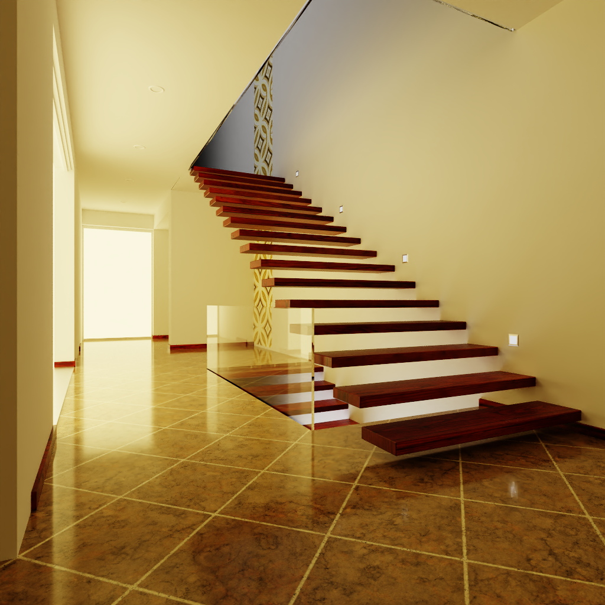

# PupilOptixLab

PupilOptixLab is a lightweight real-time ray tracing framework based on OptiX7. A basic path tracer has been implemented on PupilOptixLab.

## Features

- mistuba3-style scenes format

- pt with mis
- OptiX7 denoiser
- material: diffuse, conductor, rough conductor, dielectric, rough dielectric, plastic, rough plastic
- asynchronous GUI thread
- support native cuda code

## Prerequisites

- Visual Studio 2022
- NVIDIA graphics card with OptiX7 support
- CUDA 11.6+ (tested on 11.6 and 12.1)
- OptiX 7.5+ (for built-in sphere intersection)

## Rendering Example

### bathroom

### bathroom2

### bedroom

### kitchen

### living-room-2

### living-room-3

### staircase

### staircase2

### veach-ajar

### veach-mis

### lamp

